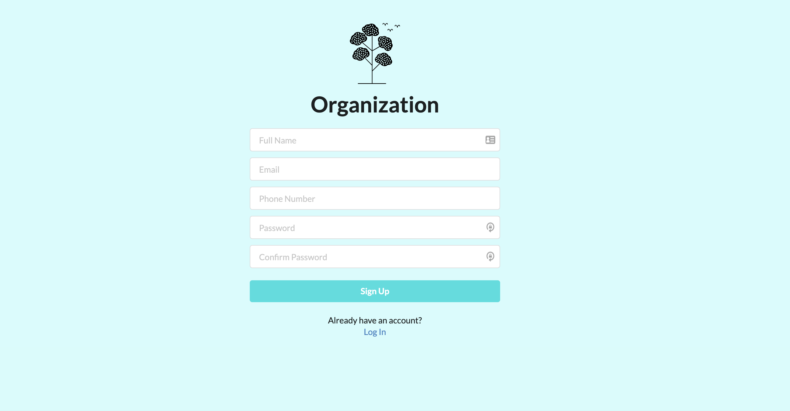
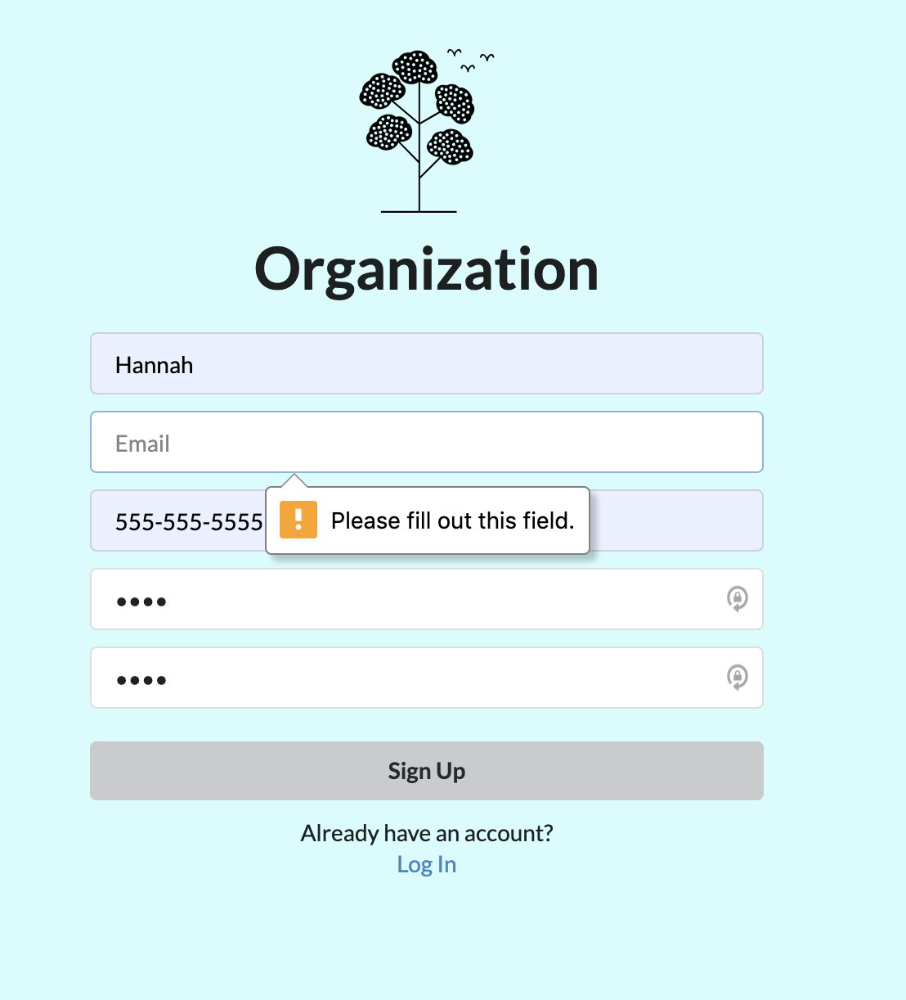
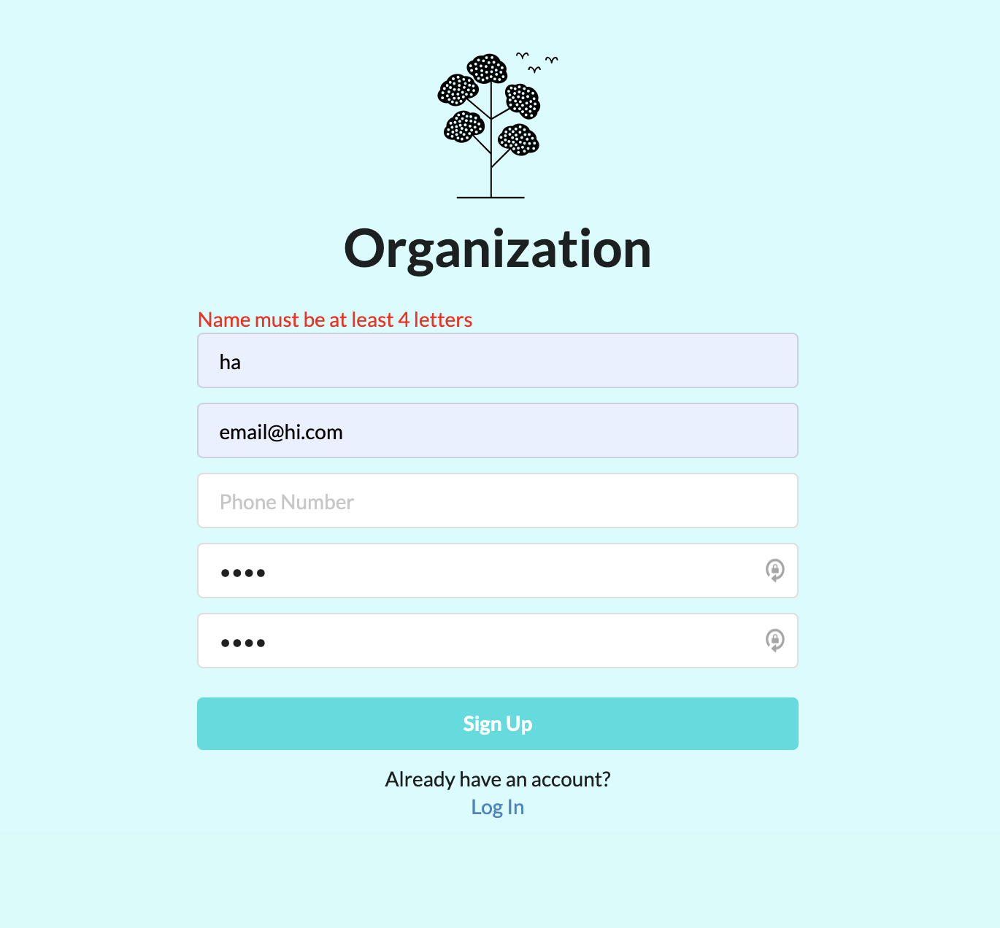
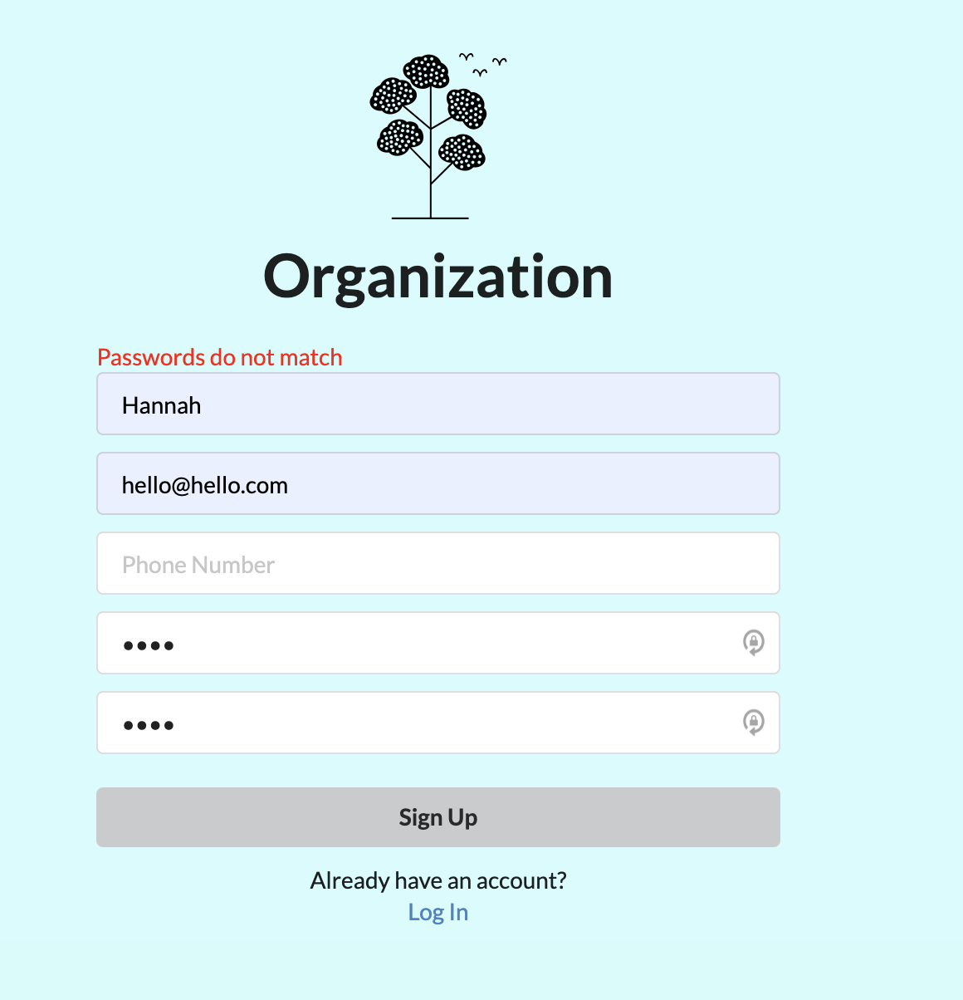
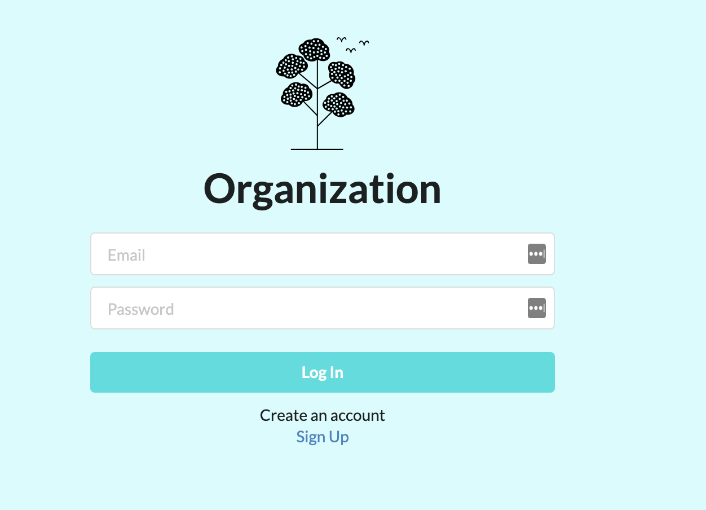
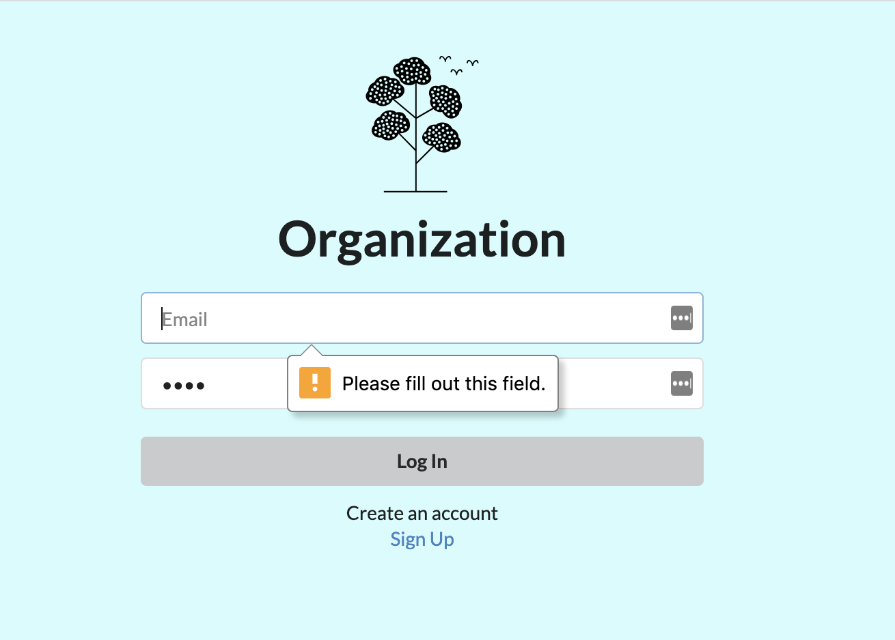
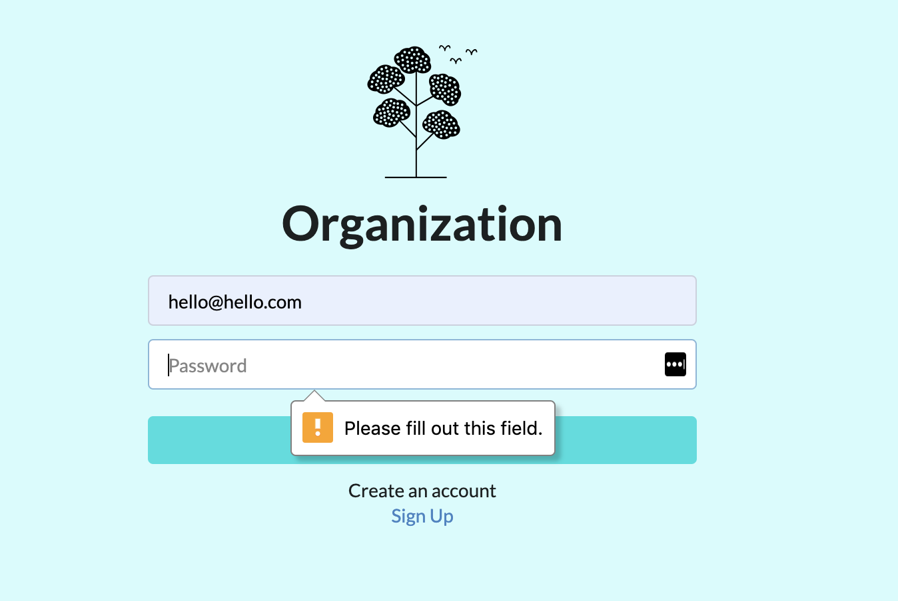

This project was bootstrapped with [Create React App](https://github.com/facebook/create-react-app).

## To Run
`npm start`
go to `http://localhost:3000/` in your browser

## Technologies
`create-react-app` includes Babel, Webpack, Jest
MobX to manage state
Segment UI for styling

## Screenshots

### Routes

`/` for SignUp route
`/login` for Login route

### Next Steps
 TESTS
 Set auth tokens to local storage upon response
 Password Strength Indicator (i.e. zxcvbn library)
 Additional styling
